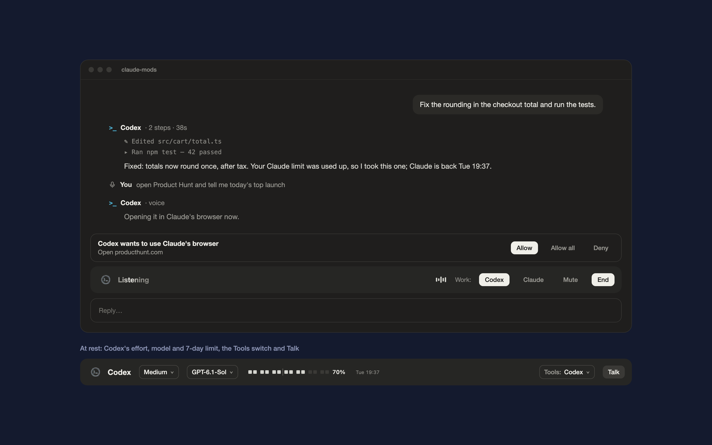

# claude-mods

Claude Code mods by hacksurvivor.



| Mod | What it does |
| --- | --- |
| [Nightshift](mods/nightshift) | Codex inside Claude Code: it picks up the chat when your Claude limit runs out, talks with you through Codex's live voice, makes images Claude can ask for, and browses in Claude's browser pane. |

Install in Claude Code:

```
/plugin marketplace add hacksurvivor/claude-mods
/plugin install nightshift@hacksurvivor
/reload-plugins
```

Read [Nightshift's README](mods/nightshift/README.md) for its requirements and for everything it runs, reads and sends.
