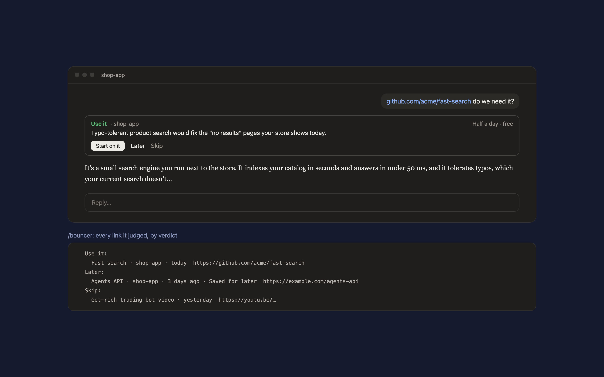

# Bouncer

A Claude Code mod for the links you paste. Every one meets the bouncer: Claude reads it, then its answer opens with a card that says whether it's worth your time.



- **Use it**, **Later** or **Skip**, which of your projects it serves, how long it takes to try, what it costs, and one line why.
- **Start on it** sends the prompt to begin; **Later** and **Skip** remember your call.
- `/bouncer` lists every link judged so far, by verdict. `/bouncer off` pauses it for the session, `/bouncer on` resumes it.

It only steps in for a link with a short question (up to 400 characters besides the link). It leaves alone local addresses, `.local` and `.test` hosts, Gmail and Google Docs links, and claude.ai and ChatGPT chats.

## Your projects

Bouncer judges each link against the projects in `~/.claude/bouncer/projects.md`, one per line:

```
- shop-app: an online store for handmade furniture
- the blog: weekly posts about remote work
```

Without that file it judges against what you're working on in the conversation and folder.

## Requirements

Claude Code 2.1.286 or later (mods). The card is drawn in the Claude desktop app and in the terminal.

## Install

In Claude Code:

```
/plugin marketplace add hacksurvivor/claude-mods
/plugin install bouncer@hacksurvivor
/reload-plugins
```

## What it runs, reads and sends

- **Reads** your prompt, to spot a pasted link, and `~/.claude/bouncer/projects.md`.
- **Sends** nothing itself. It adds a short brief to your prompt (the link, your projects, and the shape of the verdict line), which Claude Code sends to Anthropic with your message under your Claude account.
- **Keeps** up to 200 judged links in Claude Code's plugin store on your computer.
- Claude reads the link with its own tools, as it would without Bouncer.

See [PRIVACY.md](PRIVACY.md).

## License

Apache-2.0
