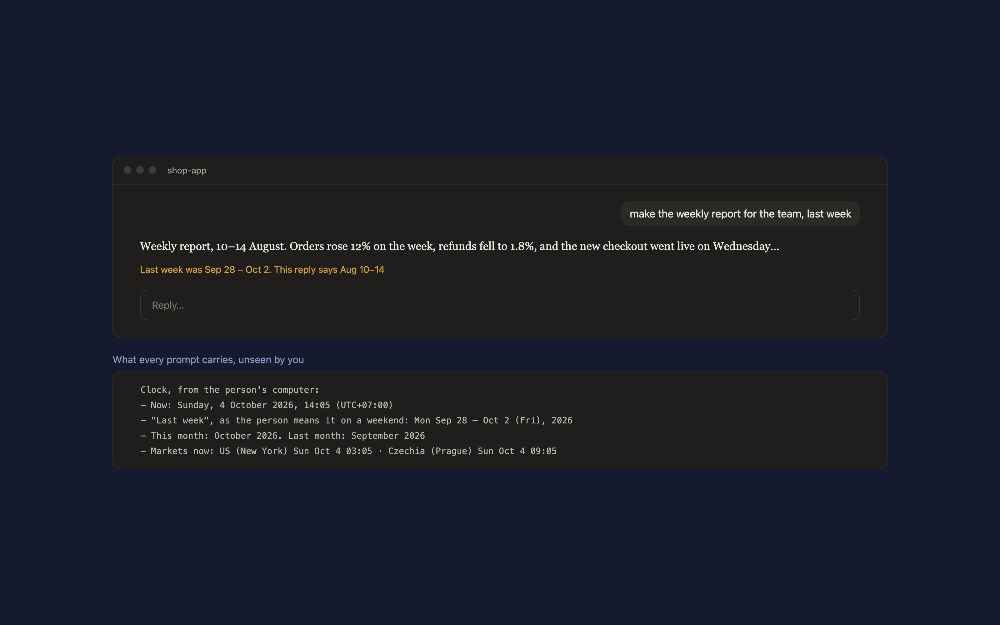

# Clock

A Claude Code mod that ends wrong dates. Every prompt quietly carries your local date, time and weekday, with yesterday, this week, last week, this month and last month worked out, so Claude never guesses them. When you ask about a period and the reply's dates miss it, a line under the reply says so.



On a weekend, "last week" means the work week that just ended. Claude is also told to keep city and timezone names out of titles, labels and file names unless you ask.

## Markets

If your work depends on the time somewhere else, list those places per folder in `~/.claude/clock/markets.json`, and their local times join the brief in that folder:

```json
[{ "folder": "/shop-app", "markets": [
  { "label": "US", "place": "New York", "zone": "America/New_York" },
  { "label": "Czechia", "place": "Prague", "zone": "Europe/Prague" }
] }]
```

## Requirements

Claude Code 2.1.286 or later (mods). The line under a reply is drawn in the Claude desktop app and in the terminal.

## Install

In Claude Code:

```
/plugin marketplace add hacksurvivor/claude-mods
/plugin install clock@hacksurvivor
/reload-plugins
```

## What it runs, reads and sends

- **Reads** your computer's clock and timezone, your prompt (to see which period you ask about), the session's folder, and `~/.claude/clock/markets.json`.
- **Sends** nothing itself. The brief is added to your prompt, which Claude Code sends to Anthropic under your Claude account.
- **Keeps** the last 20 flags in memory for the session only.

See [PRIVACY.md](PRIVACY.md).

## License

Apache-2.0
