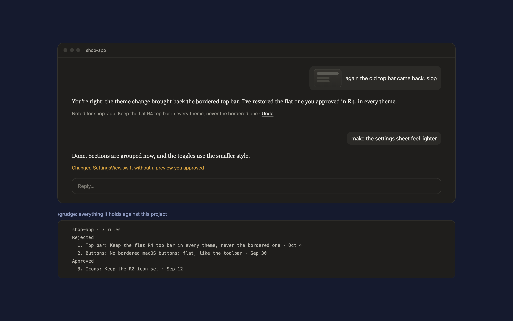

# Grudge

A Claude Code mod that holds a grudge against every look you reject, so Claude never brings it back.

You reply "this is slop" with a screenshot, or "again the old top bar". Grudge asks Claude to turn that into one rule for the project, written after it has looked at your screenshot, and keeps the screenshot with it. A line under Claude's reply shows what was noted, with **Undo**:

> Noted for shop-app: keep the R4 top bar in every theme · Undo

The next time Claude edits a UI file in that project, it is handed every rule first, along with two habits: look for real references before inventing UI, and show a preview before a new look. When Claude changes UI files without a preview you approved in the session, the reply says so:

> Changed SettingsView.swift without a preview you approved

Approvals count too. "Looks right" or picking variant "A" after a preview keeps that look as a rule, so later changes don't quietly undo it.



- `/grudge` lists the project's rules, numbered.
- `/grudge forget 2` drops one; `/grudge add <rule>` writes one yourself.
- `/grudge off` pauses it for the session, `/grudge on` resumes it.

## Requirements

- Claude Code 2.1.286 or later (mods). The notes are drawn in the Claude desktop app and in the terminal.
- Python 3 on your `PATH`, to copy a screenshot out of the session's transcript.

## Install

In Claude Code:

```
/plugin marketplace add hacksurvivor/claude-mods
/plugin install grudge@hacksurvivor
/reload-plugins
```

## What it runs, reads and sends

- **Reads** what you type, to tell a rejection or an approval from other messages, and the paths of files Claude edits, to tell UI files from the rest.
- **Runs** `bin/shot.py` with Python when you reject a look with a screenshot. It reads this session's transcript in `~/.claude/projects` and copies that message's images into `~/.claude/grudge/<project>/`. Nothing else.
- **Sends** nothing anywhere itself. The rules (and the screenshots' file paths) go to Claude as part of your conversation, under your Claude account, like any message.
- **Keeps** the rules in Claude Code's plugin store on your computer, and the screenshots in `~/.claude/grudge/`.

See [PRIVACY.md](PRIVACY.md).

## License

Apache-2.0
