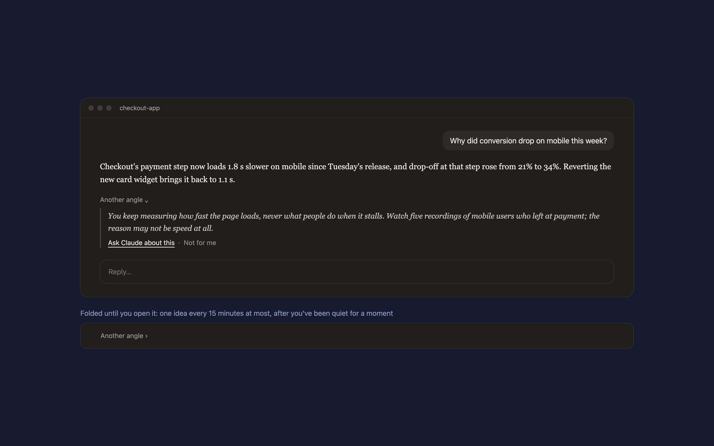

# Third eye

A Claude Code mod that shows you the idea you wouldn't have had. A little while after Claude answers, a folded footnote appears under the reply: **Another angle ›**. Open it and you get one idea from outside your usual frame, anchored in something from this chat, with the blind spot it comes from.



- **Ask Claude about this** sends the idea as your next message.
- **Not for me** hides it, and the eye remembers what you turned down so the next ideas steer away from that kind.
- `/third-eye` asks for an idea right now. `/third-eye off` rests it for the session, `/third-eye on` wakes it.

It looks at most once every 15 minutes, and only after you've been quiet for 25 seconds, so it never interrupts a back-and-forth.

## Requirements

Claude Code 2.1.286 or later (mods). The footnote is drawn in the Claude desktop app and in the terminal.

## Install

In Claude Code:

```
/plugin marketplace add hacksurvivor/claude-mods
/plugin install third-eye@hacksurvivor
/reload-plugins
```

## What it runs, reads and sends

- It asks **your session's own model** for the idea, as a fork of the current conversation, so Claude's prompt cache serves most of it. That request goes to Anthropic under your Claude account, like any other turn, and counts toward your usage.
- It reads the conversation only through that fork, plus the last reply's text after a reload.
- It keeps the ideas it showed and the ones you took or turned down in Claude Code's plugin store on your computer.
- It runs no commands, opens no network connections of its own, and has no server or analytics.

See [PRIVACY.md](PRIVACY.md).

## License

Apache-2.0
