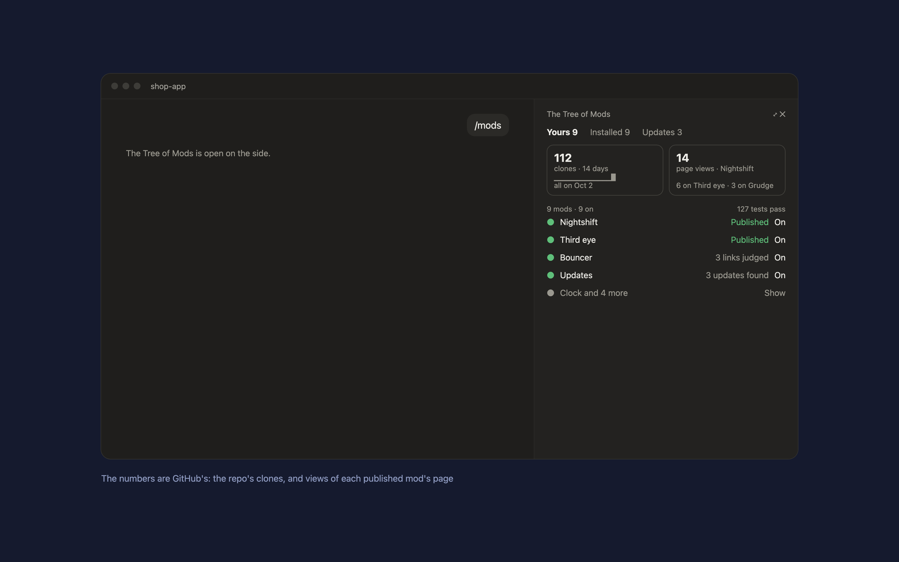

# The Tree of Mods

A Claude Code mod that puts all your mods in one panel beside the chat. Type `/mods`.



- **Yours**: the mods you make, published or only on your computer, with their tests and what each has done. Your repo's clones over 14 days and the page views of each published mod, from GitHub. Click a mod for its details and **Publish**, which asks Claude to prepare it and stops before committing or pushing.
- **Installed**: the plugins you installed from marketplaces, with versions and updates.
- **Updates**: what [Updates](../updates) found, with **Update all**, **Update** per row, **Review** for adapted copies, and **Copy command** for ones that need your password.
- **On** and **Off** switch any of them: installed plugins with `claude plugin enable` and `disable`, your own mods in your settings' `CLAUDE_CODE_PLUGIN_DIRS`.

Install counts aren't shown: Claude Code doesn't report them to authors. GitHub's clones count the whole repository and include your own.

## Where your mods are

By default, the folder this mod sits in and the GitHub remote of its repository. To point it elsewhere, write `~/.claude/tree-of-mods/config.json`:

```json
{ "modsDir": "~/code/my-mods/mods", "repo": "you/my-mods" }
```

## Requirements

- Claude Code 2.1.286 or later (mods). The panel docks beside the chat in the Claude desktop app.
- Python 3, and the GitHub CLI (`gh`) signed in with access to your repo's traffic, for the numbers.
- [Updates](../updates), for the Updates tab.

## Install

In Claude Code:

```
/plugin marketplace add hacksurvivor/claude-mods
/plugin install tree-of-mods@hacksurvivor
/reload-plugins
```

## What it runs, reads and writes

- **Runs** `bin/inventory.py`, which reads your mods folder and its git state, your installed plugins, the Updates report, and GitHub's traffic numbers for your repo (`gh api`, GET only, cached for an hour). It runs each mod's tests with `claude plugin test` when its files changed.
- **Writes** only when you ask: a switch changes `~/.claude/settings.json` (backed up first) or runs `claude plugin enable` or `disable`; an update runs that update's steps; Publish sends Claude a prompt.
- **Sends** nothing to anyone but GitHub (the traffic requests) and the services an update you start talks to.
- **Keeps** its cache in `~/.claude/tree-of-mods/`.

See [PRIVACY.md](PRIVACY.md).

## License

Apache-2.0
