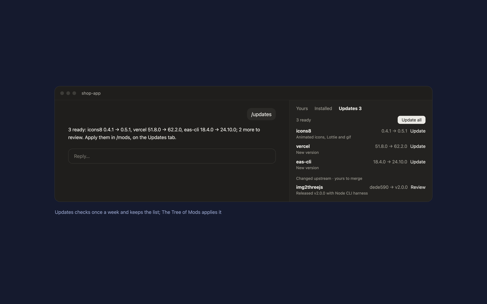

# Updates

A Claude Code mod that checks once a week what has a newer version: Claude Code plugins from git marketplaces, your global npm packages, and anything else you list. Haiku writes one line per update on what changed. `/updates` checks now.



Updates only reads. To see and apply what it found, use the **Updates** tab of [The Tree of Mods](../tree-of-mods): Update all, Update per row, and Review for copies you adapted from someone else's repo, which are never overwritten.

## What it checks

- **Claude Code plugins** installed from git or GitHub marketplaces (the official marketplace updates itself).
- **Global npm packages** with a newer release, except linked ones.
- And, from `~/.claude/updates/sources.json`:

```json
{
  "updaters": [{ "script": "my-tool-update" }],
  "updaterDir": "~/.local/bin",
  "adapted": [{ "id": "my-skill", "name": "my skill", "repo": "owner/repo",
                "pinFile": "~/skills/my-skill/SOURCE.md", "pinPattern": "Revision: `([0-9a-f]{40})`",
                "paths": ["skills/"], "local": "~/skills/my-skill" }],
  "codexPlugins": [{ "name": "my-plugin", "repo": "owner/repo" }],
  "skipMarketplaces": ["claude-plugins-official"],
  "npmSkip": ["a-package-an-updater-handles"]
}
```

`updaters` are your own update scripts with a `--check` mode that prints lines like `==> name: 1.2.0 -> 1.3.0 available`. `adapted` are copies of someone else's repo: Updates reads the upstream revision you started from in `pinFile` and compares it with the repo's latest.

## Requirements

- Claude Code 2.1.286 or later (mods), Python 3, `npm`, and the GitHub CLI (`gh`) signed in, for release and commit checks.
- [The Tree of Mods](../tree-of-mods) to apply updates.

## Install

In Claude Code:

```
/plugin marketplace add hacksurvivor/claude-mods
/plugin install updates@hacksurvivor
/reload-plugins
```

## What it runs, reads and sends

- **Runs** `bin/check.py` once a week (and on `/updates`). It calls `gh api` (GET only), `npm ls -g` and `npm outdated -g`, and your listed updaters with `--check`. It installs nothing.
- **Reads** `~/.claude/plugins` (installed plugins and marketplaces), `~/.claude/settings.json` (which plugins are on), Codex's plugin cache, and the files your config names.
- **Sends** the updates' release notes to Claude's Haiku model, under your Claude account, for the one-line summaries.
- **Keeps** the latest report in Claude Code's plugin store on your computer.

See [PRIVACY.md](PRIVACY.md).

## License

Apache-2.0
